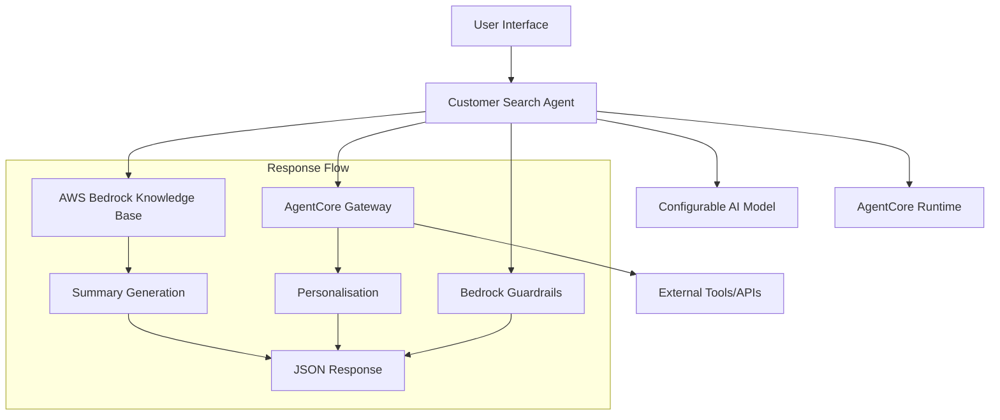

# Design Document

## Overview

The Customer Search Agent is a serverless AI-powered search system built using the Strands Framework and deployed on AWS AgentCore Runtime. The system provides intelligent information retrieval for both authenticated customers and anonymous visitors, leveraging AWS Bedrock Knowledge Base for content retrieval, configurable AI models for natural language processing (defaulting to Claude 3.7 Sonnet), and AWS AgentCore Gateway for personalisation services.

The agent accepts natural language search queries and returns structured JSON responses containing general summaries, personalised insights (for logged-in users), and source citations. The system prioritises accuracy by exclusively using retrieved content from the knowledge base and implements safety measures through AWS Bedrock Guardrails.

## Architecture

### High-Level Architecture



**Textual Architecture Overview:**
```
User Interface
    ↓
Customer Search Agent (Strands Framework)
    ├── AWS Bedrock Knowledge Base (RetrieveAndGenerate API)
    ├── Configurable AI Model (Natural Language Processing)
    ├── AgentCore Gateway (MCP Server)
    │   └── External Tools/APIs (Personalisation)
    └── Bedrock Guardrails (Content Safety)
    
Deployment Platform:
    AgentCore Runtime

Response Assembly Flow:
    1. Knowledge Base → Summary Generation
    2. Gateway Tools → Personalisation Content
    3. Guardrails → Content Validation
    4. All Components → JSON Response Assembly
```

### Component Architecture

The system follows a modular architecture with clear separation of concerns:

1. **Agent Core**: Strands Framework agent handling request orchestration
2. **Knowledge Retrieval Layer**: AWS Bedrock Knowledge Base integration
3. **Personalisation Layer**: AgentCore Gateway tool selection and invocation
4. **Safety Layer**: Bedrock Guardrails content validation
5. **Response Assembly**: JSON response construction and formatting

### Deployment Architecture

The agent is deployed as a containerised application on AWS AgentCore Runtime, providing:
- Serverless scaling and execution
- Session isolation for security
- Built-in observability and monitoring
- Automatic load balancing and fault tolerance

## Components and Interfaces

### 1. Customer Search Agent (Core Component)

**Technology**: Strands Framework with Claude 3.7 Sonnet
**Deployment**: AWS AgentCore Runtime

**Responsibilities**:
- Accept and validate input parameters (search query, user ID)
- Orchestrate knowledge retrieval and personalisation workflows
- Assemble and format JSON responses
- Handle error conditions gracefully

**Interface**:
```python
@app.entrypoint
async def invoke(payload: dict) -> dict:
    """
    Main entry point for search requests
    
    Args:
        payload: {
            "search_query": str,  # Natural language search query
            "user_id": str | None  # User identifier (optional)
        }
    
    Returns:
        {
            "personalised": str,  # User-specific content or empty
            "summary": str,       # General summary from knowledge base
            "links": List[str]    # Source URLs/citations
        }
    """
```

### 2. Knowledge Retrieval Service

**Technology**: AWS Bedrock Knowledge Base with RetrieveAndGenerate API
**Model**: Claude 3.7 Sonnet

**Responsibilities**:
- Process natural language queries against the knowledge base
- Generate coherent summaries from retrieved content
- Extract and format source citations
- Handle cases where no relevant content exists

**Interface**:
```python
class KnowledgeRetrievalService:
    async def retrieve_and_generate(
        self, 
        query: str, 
        knowledge_base_id: str
    ) -> RetrievalResult:
        """
        Query knowledge base and generate response
        
        Returns:
            RetrievalResult containing summary and citations
        """
```

### 3. Personalisation Service

**Technology**: AWS AgentCore Gateway (MCP Server)
**Integration**: Direct access to external tools (no authentication required for MVP)

**Responsibilities**:
- Discover available personalisation tools via Gateway
- Select most relevant tool based on search topic
- Invoke selected tool with user ID
- Handle tool unavailability gracefully

**Interface**:
```python
class PersonalisationService:
    async def get_personalised_content(
        self, 
        user_id: str, 
        search_topic: str
    ) -> str:
        """
        Retrieve personalised content for user and topic
        
        Returns:
            Personalised content string or empty if unavailable
        """
```

### 4. Safety and Validation Service

**Technology**: AWS Bedrock Guardrails
**Configuration**: Content safety, coherence validation

**Responsibilities**:
- Validate generated responses for harmful content
- Ensure response coherence and quality
- Block inappropriate or unsafe content
- Log safety violations for monitoring

**Interface**:
```python
class SafetyService:
    async def validate_response(self, content: str) -> ValidationResult:
        """
        Validate content against safety guardrails
        
        Returns:
            ValidationResult with approval status and details
        """
```

### 5. Response Assembly Service

**Responsibilities**:
- Combine results from all services into structured JSON
- Handle partial failures gracefully
- Ensure consistent response format
- Apply business rules for field population

**Interface**:
```python
class ResponseAssemblyService:
    def assemble_response(
        self,
        summary: str,
        personalised_content: str,
        citations: List[str]
    ) -> dict:
        """
        Assemble final JSON response
        
        Returns:
            Structured response dictionary
        """
```

## Data Models

### Input Model
```python
class SearchRequest:
    search_query: str  # Natural language search query
    user_id: Optional[str]  # User identifier for personalisation
```

### Output Model
```python
class SearchResponse:
    personalised: str  # User-specific content or empty string
    summary: str       # General summary from knowledge base
    links: List[str]   # Source URLs and citations
```

### Internal Models
```python
class RetrievalResult:
    summary: str
    citations: List[str]
    confidence_score: float

class PersonalisationResult:
    content: str
    tool_used: str
    success: bool

class ValidationResult:
    approved: bool
    violations: List[str]
    filtered_content: str
```

## Error Handling

### Error Categories and Responses

1. **Knowledge Base Unavailable**
   - Response: `{"personalised": "", "summary": "No AI summary could be found for the specified query", "links": []}`
   - Log: Error details for monitoring

2. **Personalisation Service Failure**
   - Response: Continue with empty personalised field
   - Behaviour: Graceful degradation, core functionality maintained
   - Log: Error details for monitoring and debugging

3. **Guardrails Violation**
   - Response: Block unsafe content, return safe alternative
   - Log: Safety violation details

4. **Invalid Input**
   - Response: HTTP 400 with descriptive error message
   - Validation: Input sanitisation and format checking

5. **Service Timeout**
   - Response: Partial results where possible
   - Fallback: Cached or default responses for critical paths
   - Log: Timeout details and affected services for performance monitoring

### Retry and Circuit Breaker Patterns

- **Knowledge Base**: 3 retries with exponential backoff
- **Personalisation**: 2 retries, fail gracefully if unavailable
- **Guardrails**: 2 retries, block content if service unavailable


## Deployment Configuration

### AgentCore Runtime Configuration
```python
# Strands agent configuration
agent_config = {
    "model": "${AI_MODEL}",  # Any supported model (Claude, GPT, Gemini, etc.)
    "max_tokens": 4096,
    "temperature": 0.1
}

# Runtime configuration
runtime_config = {
    "memory": "2048MB",
    "timeout": "30s",
    "concurrency": 100,
    "environment": {
        "KNOWLEDGE_BASE_ID": "${KNOWLEDGE_BASE_ID}",
        "GATEWAY_URL": "${GATEWAY_MCP_URL}",
        "GUARDRAILS_ID": "${GUARDRAILS_ID}",
        "AWS_REGION": "${AWS_REGION}",
        "AI_MODEL": "claude-3-7-sonnet",  # Any supported model (Claude, GPT, Gemini, etc.)
        "GATEWAY_AUTH_REQUIRED": "false",
        "LOG_LEVEL": "INFO"  # For debugging and monitoring
    }
    # Note: AWS credentials are automatically provided by AgentCore Runtime via IAM roles
}
```

### Environment Variables
- `KNOWLEDGE_BASE_ID`: AWS Bedrock Knowledge Base identifier
- `GATEWAY_MCP_URL`: AgentCore Gateway MCP endpoint
- `GATEWAY_AUTH_REQUIRED`: Set to "false" for MVP (no authentication)
- `GUARDRAILS_ID`: Bedrock Guardrails configuration ID
- `AWS_REGION`: AWS region for service calls
- `AI_MODEL`: Model supported


### IAM Permissions
```json
{
    "Version": "2012-10-17",
    "Statement": [
        {
            "Effect": "Allow",
            "Action": [
                "bedrock:RetrieveAndGenerate",
                "bedrock:InvokeModel",
                "bedrock:ApplyGuardrail"
            ],
            "Resource": "*"
        },
        {
            "Effect": "Allow",
            "Action": [
                "bedrock-agentcore:InvokeGateway"
            ],
            "Resource": "arn:aws:bedrock-agentcore:*:*:gateway/*"
        }
    ]
}
```

## Performance and Scalability

### Performance Targets
- **Response Latency**: Average <2 seconds, 95th percentile <5 seconds
- **Throughput**: 1000+ concurrent requests
- **Availability**: 99.9% uptime
- **Error Rate**: <1% for valid requests

### Scaling Strategy
- **AgentCore Runtime**: Automatic scaling based on demand
- **Knowledge Base**: Managed service with built-in scaling
- **Gateway**: Serverless scaling for tool invocations
- **Caching**: Response caching for frequently asked queries

### Monitoring and Observability
- **CloudWatch Metrics**: Latency, error rates, throughput
- **Distributed Tracing**: Request flow through all services
- **Custom Metrics**: Knowledge base hit rates, personalisation success rates
- **Alerting**: Performance degradation and error rate thresholds

## Security Considerations

### Authentication and Authorisation
- **User Authentication**: Optional user ID for personalisation
- **Service Authentication**: No authentication required for Gateway tools (MVP simplification)
- **IAM Roles**: Least privilege access for AWS services

### Data Protection
- **Input Sanitisation**: Prevent injection attacks
- **Content Filtering**: Bedrock Guardrails for output safety
- **Session Isolation**: AgentCore Runtime provides isolated execution
- **Audit Logging**: All requests and responses logged for compliance

### Privacy and Compliance
- **Data Minimisation**: Only necessary data processed and stored
- **Retention Policies**: Logs and metrics retention according to policy
- **Encryption**: All data encrypted in transit and at rest
- **Access Controls**: Role-based access to system components