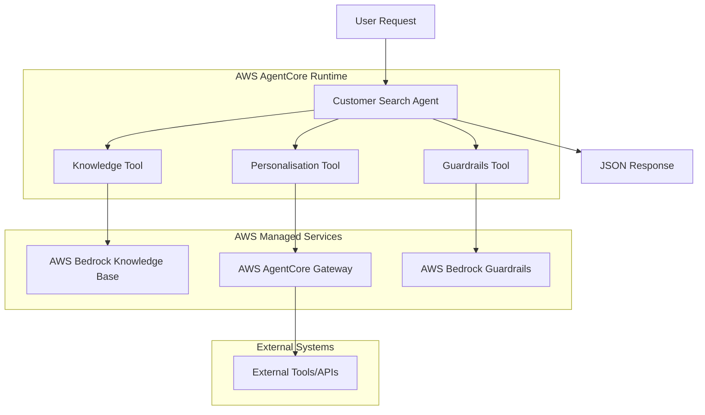
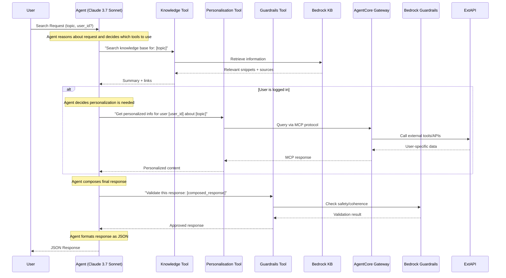

# Design Document

## Overview

The Customer Search Agent is a true AI agent built using the Strands framework and powered by Claude 3.7 Sonnet that intelligently reasons about user search requests. Rather than following predetermined logic, the agent uses natural language understanding to decide which tools to use, how to combine information, and how to best serve each user's needs.

The agent accepts natural language search queries and uses its reasoning capabilities to determine the appropriate response strategy. It can dynamically decide whether to search for general information, seek personalized content, or validate responses based on the context of each request. The architecture embodies true agentic behavior where the LLM makes intelligent decisions about tool usage rather than following rigid procedural flows.

## Architecture

### High-Level Architecture


```mermaid
graph TB
    User[User Request] --> Agent[Customer Search Agent]
    Agent --> KT[Knowledge Tool]
    Agent --> PT[Personalisation Tool]
    Agent --> GT[Guardrails Tool]
    
    KT --> KB[AWS Bedrock Knowledge Base]
    PT --> Gateway[AWS AgentCore Gateway]
    Gateway --> ExtAPI[External Tools/APIs]
    GT --> BG[AWS Bedrock Guardrails]
    
    Agent --> Response[JSON Response]
    
    subgraph "AWS AgentCore Runtime"
        Agent
        KT
        PT
        GT
    end
    
    subgraph "AWS Managed Services"
        KB
        Gateway
        BG
    end
    
    subgraph "External Systems"
        ExtAPI
    end
```

### Request Flow


```mermaid
sequenceDiagram
    participant U as User
    participant A as Agent (Claude 3.7 Sonnet)
    participant KT as Knowledge Tool
    participant PT as Personalisation Tool
    participant GT as Guardrails Tool
    participant KB as Bedrock KB
    participant GW as AgentCore Gateway
    participant BG as Bedrock Guardrails

    U->>A: Search Request (topic, user_id?)
    
    Note over A: Agent reasons about request and decides which tools to use
    
    A->>KT: "Search knowledge base for: [topic]"
    KT->>KB: Retrieve information
    KB-->>KT: Relevant snippets + sources
    KT-->>A: Summary + links
    
    alt User is logged in
        Note over A: Agent decides personalization is needed
        A->>PT: "Get personalized info for user [user_id] about [topic]"
        PT->>GW: Query via MCP protocol
        GW->>ExtAPI: Call external tools/APIs
        ExtAPI-->>GW: User-specific data
        GW-->>PT: MCP response
        PT-->>A: Personalized content
    end
    
    Note over A: Agent composes final response
    A->>GT: "Validate this response: [composed_response]"
    GT->>BG: Check safety/coherence
    BG-->>GT: Validation result
    GT-->>A: Approved response
    
    Note over A: Agent formats response as JSON
    A-->>U: JSON Response
```

## Components and Interfaces

### Main Agent Class

The core agent uses natural language reasoning to determine how to fulfill search requests:

```python
class CustomerSearchAgent:
    def __init__(self, model_config, tools, config):
        # Create agent with system prompt that defines its role and capabilities
        system_prompt = """You are a customer search agent that helps users find information.

You have access to three tools:
1. knowledge_tool: Search the company knowledge base for general information
2. personalisation_tool: Get personalized information for logged-in users (requires user_id)
3. guardrails_tool: Validate content for safety and coherence

Your goal is to provide helpful search results in this exact JSON format:
{
    "personalised": "User-specific information or empty string if not available",
    "summary": "General information summary with citations", 
    "links": ["list", "of", "source", "urls"]
}

Guidelines:
- Always search the knowledge base for general information
- Only use personalization if user_id is provided
- Always validate your final response with guardrails
- If no knowledge base results exist, return "No AI summary could be found for the specified query"
- Never fabricate facts, policies, or prices
- Always cite your sources"""

        self.agent = Agent(
            model=model_config,
            tools=tools,
            name="customer-search-agent",
            system_prompt=system_prompt
        )
        self.config = config
    
    async def search(self, search_topic: str, user_id: str = None) -> dict:
        # Let the agent reason about how to fulfill the request
        user_context = f"logged-in user {user_id}" if user_id else "anonymous visitor"
        
        prompt = f"""A {user_context} is searching for: "{search_topic}"

Please help them by:
1. Searching for relevant information in the knowledge base
2. Getting personalized information if they are logged in
3. Ensuring the response is safe and appropriate
4. Returning the results in the required JSON format"""

        invocation_state = {
            "knowledge_base_id": self.config["knowledge_base_id"],
            "gateway_mcp_url": self.config["gateway_mcp_url"],
            "guardrail_id": self.config["guardrail_id"],
            "guardrail_version": self.config["guardrail_version"],
            "user_id": user_id,
            "request_id": str(uuid.uuid4())
        }
        
        # Let the agent decide how to use tools based on the request
        response = await self.agent.invoke_async(
            prompt,
            **invocation_state
        )
        
        return self._parse_agent_response(response)
```

### Tool Interfaces

#### Knowledge Tool
```python
@tool(context=True)
async def knowledge_tool(search_topic: str, tool_context: ToolContext) -> dict:
    """Retrieve information from AWS Bedrock Knowledge Base.
    
    Args:
        search_topic: Natural language search query
        tool_context: Provides access to agent context and invocation state
                     - tool_context.invocation_state: Contains request metadata
                     - tool_context.tool_use: Current tool invocation details
    
    Returns:
        dict: Contains summary and extracted links
    """
    # Access configuration from invocation state
    kb_id = tool_context.invocation_state.get("knowledge_base_id")
    # Use tool_use for logging/tracing
    tool_use_id = tool_context.tool_use["toolUseId"]
```

#### Personalisation Tool
```python
@tool(context=True)
async def personalisation_tool(search_topic: str, user_id: str, tool_context: ToolContext) -> dict:
    """Get personalized information via AgentCore Gateway acting as MCP server.
    
    The Gateway exposes external tools/APIs as MCP tools, allowing the agent
    to discover and invoke relevant external services for personalization.
    
    Args:
        search_topic: Natural language search query
        user_id: Authenticated user identifier
        tool_context: Provides access to agent context and invocation state
                     - tool_context.invocation_state: Contains gateway configuration
                     - tool_context.agent: Reference to the invoking agent
    
    Returns:
        dict: Contains personalized information or empty if no relevant external tool found
    """
    # Access gateway configuration from invocation state
    gateway_url = tool_context.invocation_state.get("gateway_mcp_url")
    
    # Create MCP client for Gateway connection
    from strands.tools.mcp import MCPClient
    from mcp.client.streamable_http import streamablehttp_client
    
    gateway_mcp_client = MCPClient(lambda: streamablehttp_client(gateway_url))
    
    # Use context manager for MCP session
    with gateway_mcp_client:
        # Discover available tools
        available_tools = gateway_mcp_client.list_tools_sync()
        
        # Find relevant tool for search topic (semantic matching)
        relevant_tool = find_relevant_tool(available_tools, search_topic)
        
        if relevant_tool:
            # Invoke the tool with user_id
            result = gateway_mcp_client.call_tool_sync(
                tool_use_id=f"personalization-{uuid.uuid4()}",
                name=relevant_tool.name,
                arguments={"user_id": user_id, "query": search_topic}
            )
            return {"personalised": result.get("content", [{}])[0].get("text", "")}
    
    return {"personalised": ""}
```

#### Guardrails Tool
```python
@tool(context=True)
async def guardrails_tool(response_content: str, tool_context: ToolContext) -> dict:
    """Validate response content using Bedrock Guardrails.
    
    Args:
        response_content: Generated response to validate
        tool_context: Provides access to agent context and invocation state
                     - tool_context.invocation_state: Contains guardrail configuration
    
    Returns:
        dict: Validation result and approved content
    """
    # Access guardrail configuration from invocation state
    guardrail_id = tool_context.invocation_state.get("guardrail_id")
    guardrail_version = tool_context.invocation_state.get("guardrail_version")
```

### AWS Service Integration

#### Bedrock Knowledge Base Integration
- Uses `boto3` Bedrock Agent Runtime client
- Implements `retrieve_and_generate` API for semantic search
- Extracts citations from response metadata
- Handles empty results gracefully

#### AgentCore Gateway Integration
- Acts as MCP server exposing external tools/APIs as MCP tools
- Implements MCP client using Strands `MCPClient` with HTTP transport
- Uses `streamablehttp_client` to connect to Gateway's MCP endpoint
- Performs tool discovery via `list_tools_sync()` method
- Gracefully handles missing tools for search topics
- **Note**: Gateway MCP server implementation may require additional configuration not fully documented

#### Bedrock Guardrails Integration
- Uses `apply_guardrail` API for content validation
- Configures safety filters for harmful content detection
- Validates response coherence and quality
- Implements retry logic for guardrail failures

## Data Models

### Input Schema
```python
class SearchRequest:
    search_topic: str  # Required natural language query
    user_id: Optional[str] = None  # Optional user identifier
```

### Output Schema
```python
class SearchResponse:
    personalised: str  # User-specific information or empty string
    summary: str  # General information summary with citations
    links: List[str]  # Extracted source URLs
```

### Internal Data Models

#### Knowledge Base Response
```python
class KnowledgeResult:
    summary: str
    sources: List[dict]  # Contains URL and title information
    confidence_score: float
```

#### Gateway Tool Discovery
```python
class ToolMatch:
    tool_name: str
    relevance_score: float
    description: str
    input_schema: dict
```

#### Guardrails Validation
```python
class GuardrailResult:
    is_valid: bool
    filtered_content: str
    policy_violations: List[str]
    confidence_score: float
```

## Error Handling

### Knowledge Base Errors
- **No Results Found**: Log info message, return standard "No AI summary could be found" message
- **Service Unavailable**: Log error, return generic error message
- **Invalid Query**: Log warning, sanitize input and provide generic error response

### Personalization Errors
- **Gateway Unavailable**: Log error, return empty personalized field, continue with general search
- **No Matching Tools**: Log info message, return empty personalized field (expected behavior)
- **Tool Execution Failure**: Log error, return empty personalized field

### Guardrails Errors
- **Content Blocked**: Log warning, return generic "Unable to process request" message
- **Service Unavailable**: Log error, return generic error message
- **Timeout**: Log error, return timeout error message

### General Error Handling
- All errors are logged with correlation IDs for debugging
- User-facing errors never expose internal system details
- Graceful degradation ensures partial functionality when possible


## Security Considerations

### Authentication and Authorization
- User ID validation prevents unauthorized access to personalized data
- Service-to-service authentication uses IAM roles

### Data Privacy
- No user data stored in agent memory between requests
- Personalized responses isolated by user ID
- All data in transit encrypted using TLS 1.2+

### Content Safety
- Bedrock Guardrails validates all responses before returning
- Input sanitization prevents injection attacks

### Compliance
- Audit logging for all user requests and responses
- Data retention policies aligned with organizational requirements
- GDPR compliance for user data handling

### Concurrent Processing
- Knowledge and personalization tools execute in parallel
- Async/await pattern throughout the application
- Connection pooling for AWS service clients

### Resource Management
- Lambda function memory optimized for typical workloads
- Connection reuse across requests within same execution context
- Graceful timeout handling for all external service calls

## Configuration

### Environment Variables

The system requires the following environment variables for configuration:

#### AWS Service Configuration
```bash
# AWS Bedrock Knowledge Base
KNOWLEDGE_BASE_ID=your-knowledge-base-id
KNOWLEDGE_BASE_MODEL_ARN=arn:aws:bedrock:region:account:foundation-model/anthropic.claude-3-sonnet-20240229-v1:0

# AWS Bedrock Guardrails
GUARDRAIL_ID=your-guardrail-id
GUARDRAIL_VERSION=DRAFT

# AWS AgentCore Gateway
GATEWAY_MCP_URL=https://your-gateway-mcp-endpoint.amazonaws.com

# AWS Region
AWS_REGION=us-east-1
```

#### Runtime Configuration
```bash
# Response timeout (seconds)
RESPONSE_TIMEOUT=8

# Agent configuration
AGENT_NAME=customer-search-agent
LOG_LEVEL=INFO
```

#### Optional Configuration
```bash
# For development/testing
MOCK_SERVICES=false
DEBUG_MODE=false
```

### Configuration Loading
```python
class Config:
    def __init__(self):
        self.knowledge_base_id = os.environ["KNOWLEDGE_BASE_ID"]
        self.knowledge_base_model_arn = os.environ["KNOWLEDGE_BASE_MODEL_ARN"]
        self.guardrail_id = os.environ["GUARDRAIL_ID"]
        self.guardrail_version = os.environ.get("GUARDRAIL_VERSION", "DRAFT")
        self.gateway_mcp_url = os.environ["GATEWAY_MCP_URL"]
        self.aws_region = os.environ.get("AWS_REGION", "us-east-1")
        self.response_timeout = int(os.environ.get("RESPONSE_TIMEOUT", "8"))
        self.agent_name = os.environ.get("AGENT_NAME", "customer-search-agent")
        self.log_level = os.environ.get("LOG_LEVEL", "INFO")
```

## Deployment Architecture

### AWS AgentCore Runtime Configuration

#### Required Files for Deployment
```
project/
├── main.py                 # Main agent code with @app.entrypoint decorator
├── requirements.txt        # Python dependencies
├── tools/                  # Tool implementations
│   ├── knowledge_tool.py
│   ├── personalisation_tool.py
│   └── guardrails_tool.py
└── config.py              # Configuration management
```

#### Main Application Structure
```python
from bedrock_agentcore.runtime import BedrockAgentCoreApp
from strands import Agent

app = BedrockAgentCoreApp()

@app.entrypoint
async def handler(event):
    # Agent invocation logic
    search_topic = event.get("search_topic")
    user_id = event.get("user_id")
    
    agent = CustomerSearchAgent(config, tools)
    return await agent.search(search_topic, user_id)

if __name__ == "__main__":
    app.run()  # For local testing
```

#### Requirements.txt
```
strands-agents
bedrock-agentcore-starter-toolkit
boto3
httpx
pydantic
mcp  # For MCP client functionality
```

#### AgentCore CLI Deployment Commands
```bash
# Install AgentCore CLI
pip install bedrock-agentcore-starter-toolkit

# Configure the agent
agentcore configure --entrypoint main.py --non-interactive

# Deploy to AWS
agentcore launch

# Test the deployed agent
agentcore invoke '{"search_topic": "test query", "user_id": "user123"}'
```

#### Runtime Environment Variables
The AgentCore Runtime automatically provides:
- AWS credentials via IAM roles
- Region configuration
- Runtime context

Additional environment variables are configured through the deployment:
- All environment variables from the Configuration section above
- Runtime-specific variables managed by AgentCore